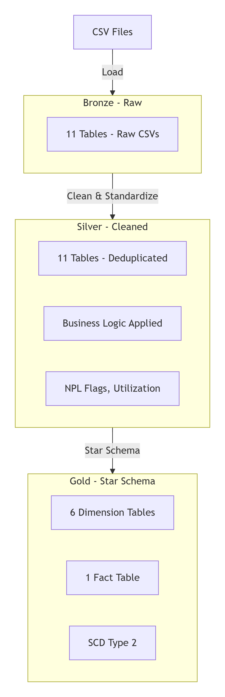

# 🏦 ETL Pipeline for Banking Analytics (Databricks)

[](https://github.com/mdmasumhowlader/etl-banking-analytics-databricks/stargazers)
[](https://github.com/mdmasumhowlader/etl-banking-analytics-databricks/blob/main/LICENSE)

## 📘 Project Overview

This project demonstrates a complete **ETL (Extract, Transform, Load) pipeline** for a banking analytics solution using **Python**, **PySpark**, and **Databricks** with Unity Catalog.

The pipeline processes banking data (customers, accounts, branches, products) and transforms it into a **Star Schema** data model optimized for analytical reporting, risk management, and business intelligence dashboards.

## 📊 Architecture
```
CSV Files → Bronze (Raw) → Silver (Cleaned) → Gold (Star Schema)
Raw Data Cleaned & Facts │ Ingestion Enriched Dimensions │ Data Tables
```
## 📂 Notebook Structure
```
The project is organized into 2 main folders in Databricks:
📁 data_processing/ # ETL Processing & Metadata
├── data_loading.py # Load CSV → Bronze (Raw Data)
├── data_transformation.py # Bronze → Silver (Clean & Enrich)
├── star_schema.py # Silver → Gold (Star Schema)
└── metadata.py # Schemas, primary keys, business logic

📁 schema_definition/ # DDL Scripts
├── bronze_tables.sql # Create Bronze layer (11 tables)
├── silver_tables.sql # Create Silver layer (11 tables)
├── gold_tables.sql # Create Gold layer (7 tables)
├── drop_silver_tables.sql # Utility: Drop all Silver tables
└── additional_scripts.sql # Additional DDL scripts
```
## 🔧 Key Features
- **Medallion Architecture:** Bronze (raw), Silver (cleaned/enriched), Gold (analytics-ready)
- **Star Schema Design:** 6 Dimension tables + 1 Fact table for investment risk analytics
- **SCD Type 2 Support:** Tracks historical changes in dimension tables
- **Data Quality Rules:** Null handling, deduplication, string standardization
- **Business Logic:** Derived flags (NPL, utilization ratio, risk categories)
- **Python/PySpark:** All transformations using PySpark DataFrames and Delta Lake

## 🔧 Catalog & Schema Structure (Unity Catalog)
```
inv_risk_mgmt/ # Unity Catalog
├── bronze/ # Raw layer (11 tables)
│ ├── branches
│ ├── business_units
│ ├── cl_categories
│ ├── customer_types
│ ├── customers
│ ├── districts
│ ├── divisions
│ ├── financing_accounts
│ ├── financing_products
│ ├── industries
│ └── thanas
├── silver/ # Cleaned layer (11 tables)
│ ├── branches
│ ├── business_units
│ ├── cl_categories
│ ├── customer_types
│ ├── customers
│ ├── districts
│ ├── divisions
│ ├── financing_accounts
│ ├── financing_products
│ ├── industries
│ └── thanas
└── gold/ # Star Schema (7 tables)
├── dim_branch
├── dim_business_unit
├── dim_cl_category
├── dim_customer
├── dim_financing_product
├── dim_industry
└── fact_financing_account
```

### Relationship Diagram

```
## 📊 Entity Relationship Diagram (ERD)
```
┌─────────────────────────────────────────────────────────────────────────────────────────────┐
│                                      Star Schema (Gold Layer)                               │
│                                                                                             │
│  ┌──────────────────┐     ┌──────────────────┐     ┌─────────────────────────────────────┐ │
│  │  DIM_CUSTOMER    │     │   DIM_BRANCH     │     │                                     │ │
│  │                  │     │                  │     │                                     │ │
│  │ CUSTOMER_SK (PK) │────▶│ BRANCH_SK (PK)   │────▶│                                     │ │
│  │ CUSTOMER_ID      │     │ BRANCH_ID        │     │  FACT_FINANCING_ACCOUNT             │ │
│  │ CUSTOMER_NAME    │     │ BRANCH_NAME      │     │                                     │ │
│  │ CUSTOMER_TYPE    │     │ THANA_NAME       │     │ ACCOUNT_ID (PK)                    │ │
│  │ RISK_LEVEL       │     │ DISTRICT_NAME    │     │ CUSTOMER_SK (FK) ──────────────────┘ │
│  └──────────────────┘     │ DIVISION_NAME    │     │ BRANCH_SK (FK) ────────────────────┐ │
│  ┌──────────────────┐     └──────────────────┘     │ PRODUCT_SK (FK) ──────────────────┐ │
│  │ DIM_PRODUCT      │     ┌──────────────────┐     │ INDUSTRY_SK (FK) ────────────────┐ │
│  │                  │     │ DIM_INDUSTRY     │     │ BUSINESS_UNIT_SK (FK) ──────────┐ │
│  │ PRODUCT_SK (PK)  │────▶│                  │     │ CL_CATEGORY_SK (FK) ───────────┐ │ │
│  │ PRODUCT_ID       │     │ INDUSTRY_SK (PK) │     │ ACCOUNT_NO                    │ │ │
│  │ PRODUCT_CODE     │     │ INDUSTRY_ID      │     │ SANCTION_AMOUNT               │ │ │
│  │ PRODUCT_NAME     │     │ SECTOR_NAME      │     │ OUTSTANDING_AMT               │ │ │
│  │ PRODUCT_TYPE     │     │ SUB_SECTOR_NAME  │     │ PRINCIPAL_BALANCE             │ │ │
│  └──────────────────┘     │ RISK_CATEGORY    │     │ ACC_PROFIT_RATE               │ │ │
│  ┌──────────────────┐     └──────────────────┘     │ CL_STATUS                    │ │ │
│  │ DIM_BUSINESS_UNIT│     ┌──────────────────┐     │ BALANCE_DATE                 │ │ │
│  │                  │     │ DIM_CL_CATEGORY  │     └──────────────────────────────┘ │ │
│  │ BUSINESS_UNIT_SK │────▶│                  │                                     │ │
│  │ BUSINESS_UNIT_ID │     │ CL_CATEGORY_SK   │                                     │ │
│  │ BUSINESS_UNIT    │     │ CL_CATEGORY_ID   │                                     │ │
│  └──────────────────┘     │ CL_CODE          │                                     │ │
│                            │ DESCRIPTION      │                                     │ │
│                            └──────────────────┘                                     │ │
└─────────────────────────────────────────────────────────────────────────────────────┘ │
```
## Data Flow Diagram


## Data Lineage
```
┌─────────────────────────────────────────────────────────────────────────────┐
│                          BRONZE → SILVER → GOLD                             │
│                                                                             │
│  Bronze                    Silver                    Gold                   │
│  ──────                    ──────                    ────                   │
│                                                                             │
│  DIVISIONS ─────────────▶  DIVISIONS ────────────▶  DIM_BRANCH (via joins) │
│  DISTRICTS ─────────────▶  DISTRICTS ────────────▶  DIM_BRANCH (via joins) │
│  THANAS ─────────────────▶  THANAS ──────────────▶  DIM_BRANCH (via joins) │
│  BRANCHES ──────────────▶  BRANCHES ─────────────▶  DIM_BRANCH             │
│                                                                             │
│  CUSTOMER_TYPES ────────▶  CUSTOMER_TYPES ──────▶  DIM_CUSTOMER            │
│  CUSTOMERS ─────────────▶  CUSTOMERS ────────────▶  DIM_CUSTOMER           │
│                                                                             │
│  INDUSTRIES ─────────────▶  INDUSTRIES ──────────▶  DIM_INDUSTRY           │
│  FINANCING_PRODUCTS ────▶  FINANCING_PRODUCTS ──▶  DIM_PRODUCT             │
│                                                                             │
│  BUSINESS_UNITS ────────▶  BUSINESS_UNITS ──────▶  DIM_BUSINESS_UNIT       │
│                                                                             │
│  CL_CATEGORIES ─────────▶  CL_CATEGORIES ──────▶  DIM_CL_CATEGORY          │
│                                                                             │
│  FINANCING_ACCOUNTS ────▶  FINANCING_ACCOUNTS ─▶  FACT_FINANCING_ACCOUNT   │
│                                                                             │
└─────────────────────────────────────────────────────────────────────────────┘
```
## 📝 Notebook Details
1. data_loading.py (Bronze Layer)
Reads CSV files from Databricks Volumes

Parses date/timestamp formats

Adds metadata columns (ingestion_time, source_file)

Writes to Bronze tables

2. data_transformation.py (Silver Layer)
Deduplicates using primary keys

Standardizes string columns (trim, uppercase)

Applies data quality rules

Implements business logic using metadata.py

Writes to Silver tables

3. star_schema.py (Gold Layer)
Builds Dimension tables with SCD Type 2

Creates Fact table with foreign keys

Joins dimension tables

Handles unknown/default values (-1, -2)

Writes to Gold tables

4. metadata.py (Shared Configuration)
Table schemas (11 tables)

Primary key definitions

Business logic configurations

Dimensional configurations

Shared across all processing notebooks


## 🐛 Challenges & Solutions

### Challenge 1: Date/Time Format Parsing
**Problem:** CSV files contained multiple date formats (`M/d/yyyy h:mm:ss a`, `M/d/yyyy h:mm:ss.SSSSSS a`).  
**Solution:** Implemented custom timestamp parsing in `data_loading.py` using `F.to_timestamp()` with format string detection.

### Challenge 2: Business Logic Centralization
**Problem:** Business rules (NPL flag, utilization ratio, product categorization) were scattered across notebooks.  
**Solution:** Centralized all business logic in `metadata.py` using a reusable `apply_business_logic()` function.

### Challenge 3: SCD Type 2 Implementation
**Problem:** Needed to track historical changes in dimension tables.  
**Solution:** Implemented `add_scd2_columns()` function in `star_schema.py` to add `START_DATE`, `END_DATE`, and `IS_CURRENT` columns.

## 🛠️ Technologies Used

| Category | Technologies |
|----------|--------------|
| **Platform** | Databricks (Unity Catalog) |
| **Languages** | Python, PySpark, SQL |
| **Storage** | Delta Lake |
| **Data Format** | CSV (source), Delta (gold/silver/bronze) |
| **Version Control** | Git (GitHub) |
| **Data Model** | Star Schema (Kimball) |

## 🚀 Getting Started

### Prerequisites
- Databricks workspace with Unity Catalog enabled
- Catalog: `inv_risk_mgmt` (or your custom catalog)
- Access to Databricks Volumes for CSV storage
- Python 3.x with PySpark

### Quick Start (Databricks)

1. **Clone the repository:**
   ```bash
   git clone https://github.com/mdmasumhowlader/etl-banking-analytics-databricks.git

2. **Upload CSV files to Databricks Volumes:**
 - Path: /Volumes/inv_risk_mgmt/raw_data/csv/{load_date}/
 - Files: All table CSV files

3. **Create Bronze tables:**
 - Run schema_definition/bronze_tables.sql in Databricks SQL

4. **Run the ETL pipeline:**
# Notebook 1: Load raw data
%run ./data_processing/data_loading

# Notebook 2: Transform to Silver
%run ./data_processing/data_transformation

# Notebook 3: Build Star Schema
%run ./data_processing/star_schema

5. **Verify data:**
SELECT * FROM inv_risk_mgmt.gold.fact_financing_account LIMIT 10;


## 🔗 Project Links
GitHub Repository: mdmasumhowlader/etl-banking-analytics-databricks

Architecture Document: ./docs/architecture.md

Data Dictionary: ./docs/data_dictionary.md

## 📝 License
This project is licensed under the MIT License - see the LICENSE file for details.


⭐️ If you found this project helpful, please consider giving it a star on GitHub!
**Author:** Md. Masum Howlader  
**GitHub:** [mdmasumhowlader](https://github.com/mdmasumhowlader)  
**LinkedIn:** [md-masum-howlader](https://www.linkedin.com/in/md-masum-howlader-062927220/)